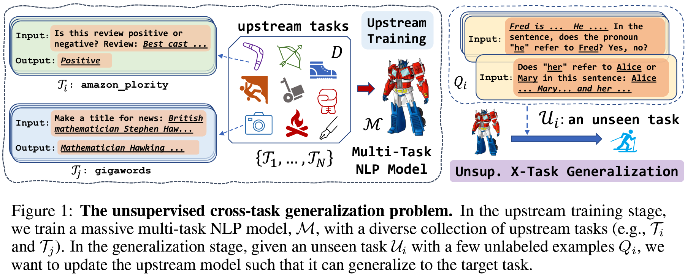

 
# ReCross | Unsupervised Cross-Task Generalization via Retrieval Augmentation
{: .fs-7 .fw-700 .text-blue-300 }

---
<span class="fs-2">
[Paper](https://yuchenlin.xyz/files/cmr.pdf){: target="_blank" .btn .btn-green .mr-1 .fs-3}
[Github](https://github.com/yuchenlin/CMR/){: target="_blank" .btn .btn-purple .mr-1 .fs-3 }
[Video](#){: target="_blank" .btn .btn-blue .mr-1 .fs-3 }
[Slides](#){: target="_blank" .btn .btn-red .mr-1 .fs-3 }
</span>


<!--
--- 
<span class="fs-2">
[Data](/data){: .btn .btn-green .mr-1 }
[Methods](/methods){: .btn .btn-purple .mr-1 }
[Metrics](/metrics){: .btn .btn-blue .mr-1 }
[Leaderboard](/leaderboard){: .btn .btn-red .mr-1 }
</span>
-->

---


<!-- {: style="text-align:center; display:block; margin-left: auto; margin-right: auto;" width="100%"} -->

This is the project site for the paper, [_**Unsupervised Cross-Task Generalization via Retrieval Augmentation**_](https://arxiv.org/abs/2204.07937), by [_Bill Yuchen Lin_](https://yuchenlin.xyz/), Kangmin Tan, Chris Miller, Beiwen Tian, and [Xiang Ren](http://www-bcf.usc.edu/~xiangren/).


---

<!-- 
 <style type="text/css">
    .image-left {
      display: block;
      margin-left: auto;
      margin-right: auto;
      float: right;
    }
 
    table th:first-of-type {
        width: 10
    }
    table th:nth-of-type(2) {
        width: 10
    }
    table th:nth-of-type(3) {
        width: 50
    }
    table th:nth-of-type(4) {
        width: 30
    } 

    </style> -->


<!-- {: style="text-align:center; display:block; margin-left: auto; margin-right: auto;" width="100%"} -->
 
<!-- {: .fs-3 .fw-300 } -->
### Abstract
Real-world natural language processing (NLP) models need to be continually updated to fix the prediction errors in out-of-distribution (OOD) data streams while overcoming catastrophic forgetting. However, existing continual learning (CL) problem setups cannot cover such a realistic and complex scenario. In response to this, we propose a new CL problem formulation dubbed continual model refinement (CMR). Compared to prior CL settings, CMR is more practical and introduces unique challenges (boundary-agnostic and non-stationary distribution shift, diverse mixtures of multiple OOD data clusters, error-centric streams, etc.). We extend several existing CL approaches to the CMR setting and evaluate them extensively. For benchmarking and analysis, we propose a general sampling algorithm to obtain dynamic OOD data streams with controllable nonstationarity, as well as a suite of metrics measuring various aspects of online performance. Our experiments and detailed analysis reveal the promise and challenges of the CMR problem, supporting that studying CMR in dynamic OOD streams can benefit the longevity of deployed NLP models in production.


---

```bibtex
@inproceedings{lin-etal-2022-cmr,
    title = "On Continual Model Refinement in Out-of-Distribution Data Streams",
    author = "Lin, Bill Yuchen and Wang, Sida and Lin, Xi Victoria and Jia, Robin and Xiao, Lin and Ren, Xiang and Yih, Wen-tau",
    booktitle = "Proceedings of the 60th Annual Meeting of the Association for Computational Linguistics (ACL 2022)",
    year = "2022"
}
```